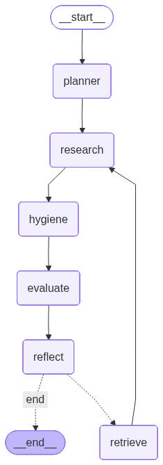

# 🌌 Antigravity Autonomous Research Agent



> **"Probabilistic Intelligence, Deterministic Control."**

**Antigravity** is an autonomous AI agent designed for deep, recursive research. Unlike standard chatbots that hallucinate or lose context during long tasks, Antigravity uses a strict, deterministic graph architecture to plan, execute, value, and refine its own work.

Built by **Aditya**.

---

## 🏗️ System Architecture

The system is built on **LangGraph**, treating the LLM not as a brain, but as a component in a larger state machine. 

### The Cyclic Graph
The agent operates in a continuous loop:

1.  **Planner Node:** break down the user's high-level goal into a step-by-step research plan.
2.  **Research Node:** Executes web searches using privacy-focused tools (DuckDuckGo).
3.  **Hygiene Node:** Compresses raw search noise into structured JSON data.
4.  **Evaluator Node:** Mathematically scores the relevance of findings.
5.  **Reflection Node:** Critiques the findings and decides whether to loop back or finish.
6.  **Retrieval Node:** Fetches long-term memories from the Vector Store.
7.  **Reporter Node:** Compiles the final report.

---

## 🚀 Unique Features

### 1. Context Hygiene (The "Secret Sauce")
Most agents fail because they stuff their context window with 20,000+ characters of raw HTML.
Antigravity uses a dedicated **Hygiene Node** that passes all raw research through a **Structure-Aware LLM**.
-   **Input:** 15,000 chars of noise.
-   **Output:** ~500 chars of strict JSON (Key Findings, Statistics, Risks).
-   **Result:** 90% reduction in token costs and massively improved focus.

### 2. Deterministic vs. Probabilistic
We impose **Deterministic Guardrails** on **Probabilistic Models**.
-   **Probabilistic:** The LLM generates the content.
-   **Deterministic:** The Code controls the flow.
The agent *cannot* skip steps. It *must* evaluate its work. If the score is low, the code forces a retry, preventing lazy answers.

### 3. Model Agnostic
Currently powered by **Gemini 2.5 Flash**, but the architecture allows instant switching to GPT-4, Claude 3.5 Sonnet, or local Llama 3 models.

---

## 🧠 Memory Handling (RAG)

Antigravity separates memory into:
1.  **Working Memory:** The active context for the current loop.
2.  **Long-Term Memory:** A **Vector Store (ChromaDB)**.

Every verified fact is embedded and stored. When the agent needs to answer a follow-up question 50 steps later, it runs a semantic search against ChromaDB to retrieve the exact answer without cluttering its active context.

---

## 🛠️ Installation & Usage

1.  **Clone the Repository**
    ```bash
    git clone https://github.com/Adyypower/MediAgent-System-.git
    cd antigravity_agent
    ```

2.  **Install Dependencies**
    ```bash
    pip install -r requirements.txt
    ```

3.  **Run the Web UI**
    ```bash
    streamlit run antigravity_agent/app.py
    ```

4.  **Run in CLI Mode**
    ```bash
    python antigravity_agent/main.py
    ```

---

## 🔮 Future Plans
-   **Multi-Agent Swarm:** Separate 'Critic' and 'Writer' agents.
-   **Human-in-the-Loop:** UI for manual plan approval.
-   **Local Execution:** Full offline support with Ollama.

---
*Built with ❤️ by Aditya*
